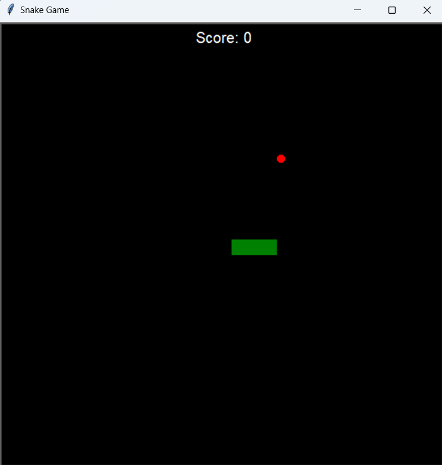
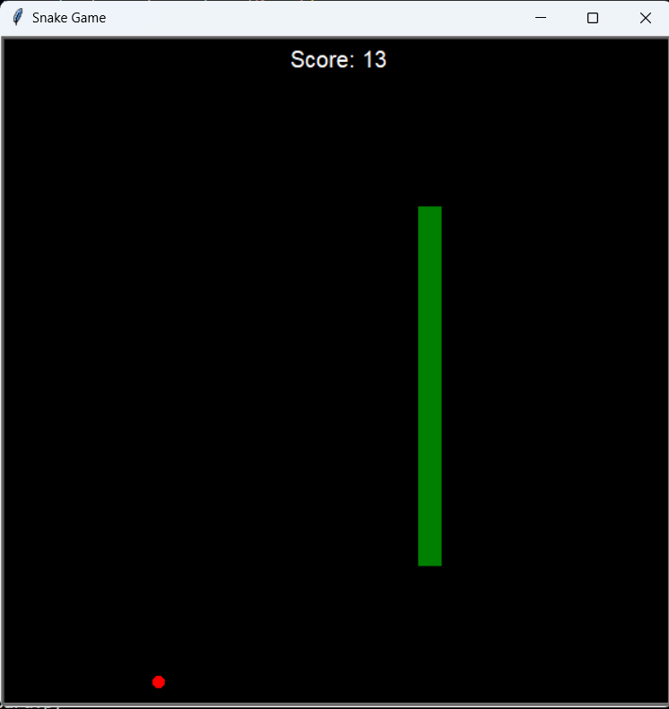
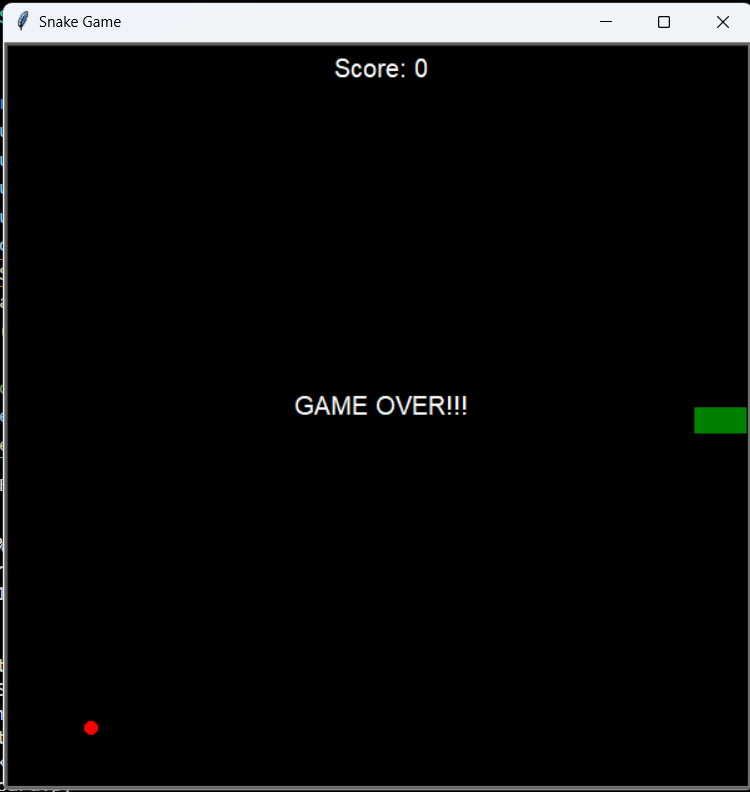
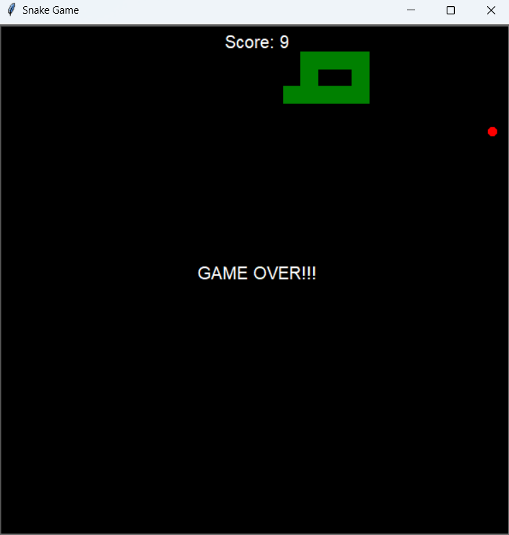

# Snake Game Project

## Overview
Welcome to the Snake Game project! This classic implementation of the snake game is a fun and entertaining project created using Python turtle. The game allows players to control a snake, eat food to grow longer, and challenge their reflexes.

## Screenshots
Here are three snapshots from the Snake Game project:

### 1. Game Start
   
   - This image captures the initial state of the game, with the snake ready to embark on its journey. Get ready to maneuver through the grid and collect tasty treats!

### 2. Game In Progress
   
   - Experience the thrill of the game with this screenshot, showcasing the snake in action. Guide it skillfully to consume the food items, and watch as it grows longer with each successful capture.

### 3. Game Over
   - _**Game over one**_
   
   - _**Game over Two**_
   
   - The game over screen marks the end of the journey. Whether the snake collided with itself or hit the boundaries, this image signifies the conclusion of the game. Try again for a higher score!

## How to Run the Game
Follow these steps to run the Snake Game project on your machine:

1. **Install Python:**
   Ensure that Python is installed on your system. If not, download it from [python.org](https://www.python.org/downloads/).

2. **Clone this repo:** Then run it by cofiguring the interpreter